# Adjoint Sampling with Stein-Based Variance Reduction — Full Results

> **Generated:** (pending)
> **Repo:** `adjoint_samplers`
> **Methods:** 7 enhancement pipelines evaluated across 3 molecular systems

---

## Table of Contents

1. [Overview](#1-overview)
2. [Systems Under Test](#2-systems-under-test)
3. [Methods](#3-methods)
4. [DW4 — Double Well 4 Particles (8D)](#4-dw4--double-well-4-particles-8d)
5. [LJ13 — Lennard-Jones 13 Particles (39D)](#5-lj13--lennard-jones-13-particles-39d)
6. [LJ55 — Lennard-Jones 55 Particles (165D)](#6-lj55--lennard-jones-55-particles-165d)
7. [Cross-System Comparison](#7-cross-system-comparison)
8. [Ablations](#8-ablations)
9. [Key Takeaways](#9-key-takeaways)

---

## 1. Overview

We train Adjoint Sampling with Bridge Splitting (ASBS) to sample from Boltzmann distributions of molecular systems, then apply 7 post-hoc enhancement methods to reduce estimator bias and variance for the mean energy $\langle E \rangle_p$.

**Evaluation protocol:**
- 10 independent seeds per configuration
- Sample sizes: N ∈ {100, 500, 1000, 2000}
- Ground truth: sample mean of 10,000 reference samples from the target distribution
- All metrics reported as mean ± std across seeds

---

## 2. Systems Under Test

| System | Particles | Spatial Dim | Total Dim | Energy | Reference Samples |
|--------|-----------|-------------|-----------|--------|-------------------|
| DW4 | 4 | 2D | **8** | Pairwise double-well | 10,000 |
| LJ13 | 13 | 3D | **39** | Lennard-Jones + harmonic | 10,000 |
| LJ55 | 55 | 3D | **165** | Lennard-Jones + harmonic | 10,000 |

**DW4** — $E_{\text{DW}}(d) = 0.9(d-4)^4 - 4(d-4)^2$ pairwise over 4 particles in 2D. Fast iteration, good for debugging all enhancements.

**LJ13** — $E_{\text{LJ}}(r) = \varepsilon\left[\left(\frac{r_{\min}}{r}\right)^{12} - 2\left(\frac{r_{\min}}{r}\right)^6\right]$ with $\varepsilon=1, r_{\min}=1$ and external harmonic confinement. 13 particles in 3D with COM constraint. Medium complexity.

**LJ55** — Same LJ potential, 55 particles in 3D. High-dimensional stress test (165D). RKHS kernels degrade; Neural Stein CV is the primary method here.

---

## 3. Methods

| # | Method | Key Idea | Complexity | Bias Fix? | Var Fix? |
|---|--------|----------|------------|-----------|----------|
| 1 | **Vanilla ASBS** | Sample mean $\frac{1}{N}\sum f(x_i)$ | $O(N)$ | ✗ | ✗ |
| 2 | **Stein CV (RKHS)** | Optimal RKHS control variate via kernel ridge regression | $O(N^3)$ | ✓ (coupling) | ✓ |
| 3 | **Antithetic** | Paired trajectories with negated Brownian noise | $O(N)$ | ✗ | ✓ |
| 4 | **MCMC Corrected** | K Metropolis-Hastings steps on terminal samples | $O(KN)$ | ✓ | ✗ |
| 5 | **MCMC + Stein CV** | MCMC first, then RKHS Stein CV | $O(KN + N^3)$ | ✓✓ | ✓ |
| 6 | **Generator Stein CV** | Uses learned drift $b_\theta(x,1)$ instead of $s_p(x)$ | $O(N^3)$ | ✓ (coupling) | ✓ |
| 7 | **Neural Stein CV** | MLP $g_\phi$ trained on PDE loss $\|\nabla_x h\|^2$ | $O(BdT)$ | ✓ (coupling) | ✓ |
| 8 | **EGNN Stein CV** | Equivariant $g_\phi$ (same arch as ASBS controller) on PDE loss | $O(Bn^2LT)$ | ✓ (coupling) | ✓ |
| 9 | **RBF Collocation CV** | Expand $g$ in Gaussian RBF basis, single least-squares solve | $O(NdM + M^3)$ | ✓ (differentiated PDE) | ✓ |

**Methods 8–9 are new advances** addressing the instability of Neural Stein CV (method 7):
- **EGNN Stein CV** exploits the particle structure and E(3) symmetry of molecular systems. The MLP ignores that DW4/LJ are particle systems — EGNN enforces equivariance by construction, constraining $g_\phi$ to physically meaningful vector fields.
- **RBF Collocation CV** avoids neural network training entirely. By expanding $g$ in a Gaussian RBF basis, the differentiated PDE becomes a **linear least-squares** problem — one matrix solve, no epochs, no gradient instability. Uses the same differentiated PDE form as Neural CV (eliminates unknown $c$) but with deterministic, non-iterative solving.

**Bias-Variance Coupling Theorem (v2):**
$$|\text{Bias}| \leq \sqrt{C \cdot \text{Var}_{q_\theta}[f + \mathcal{A}_p g]}$$
Optimizing $g$ for variance reduction *automatically* shrinks the bias. This means Stein CVs alone can handle both — MCMC correction is optional, not required.

---

## 4. DW4 — Double Well 4 Particles (8D)

### 4.1 Training

| Parameter | Value |
|-----------|-------|
| Experiment | `dw4_asbs` |
| Epochs | 5000 |
| NFE | 200 |
| σ_max / σ_min | 1.0 / 0.001 |
| Source | Harmonic (scale=2) |
| Checkpoint | `results/local/2026.03.31/152919/checkpoints/checkpoint_latest.pt` |

### 4.1.1 Ground Truth

Computed from 10,000 reference samples drawn from the true Boltzmann distribution $p \propto e^{-E(x)}$ (`data/test_split_DW4.npy`), evaluated through `DoubleWellEnergy.eval()`:

| Statistic | Value |
|-----------|-------|
| **Mean** | **-22.4504** |
| Std | 1.9015 |
| Median | -22.7987 |
| [5th, 95th] %ile | [-24.9067, -18.8260] |
| [Min, Max] | [-25.7486, -11.8381] |

### 4.2 Summary Table (N = 2000, 10 seeds)

| Method | Mean Energy | |Error| | Variance | Var Ratio |
|--------|-------------|--------|----------|-----------|
| **Ground Truth** | -22.4504 | 0 | — | — |
| Vanilla ASBS | -22.4093 | 0.0456 | 1.92e-03 | 1.000 |
| Stein CV (RKHS) | -25.0794 | 2.6290 | 1.45e-03 | 0.759 |
| Antithetic | -22.4102 | 0.0676 | 2.71e-03 | 0.696 |
| MCMC (K=10) | -22.4084 | 0.0467 | 1.92e-03 | — |
| MCMC + Stein CV | -24.8511 | 2.4007 | 1.31e-03 | — |
| Generator Stein CV | -22.3936 | 0.0680 | 4.73e-03 | — |
| Neural Stein CV | -21.8515 | 0.7469 | 5.91e-01 | 308.925 |
| **EGNN Stein CV** | -21.8416 | 0.7518 | 6.01e-01 | 314.051 |
| **RBF Collocation CV** | -22.4943 | 0.1023 | 1.66e-01 | 86.479 |

### 4.3 Diagnostics

| Metric | Value |
|--------|-------|
| KSD² | 0.0201 ± 0.0118 |
| MH Acceptance Rate | 0.0041 |
| Antithetic Correlation | 0.3836 |

### 4.4 Plots

#### Estimation Error vs Sample Size
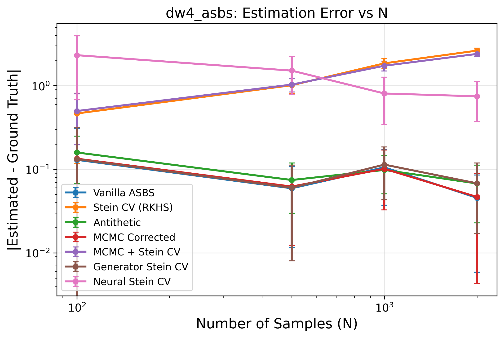

#### Estimator Variance vs Sample Size
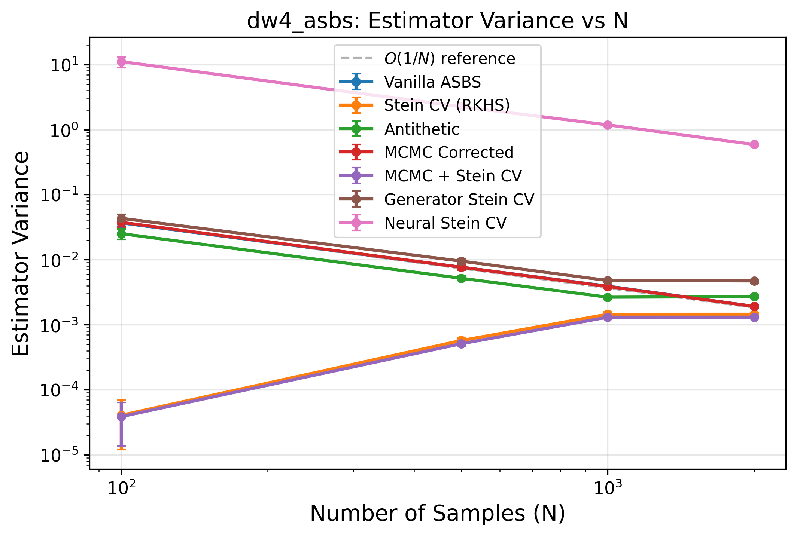

#### Variance Reduction Factors
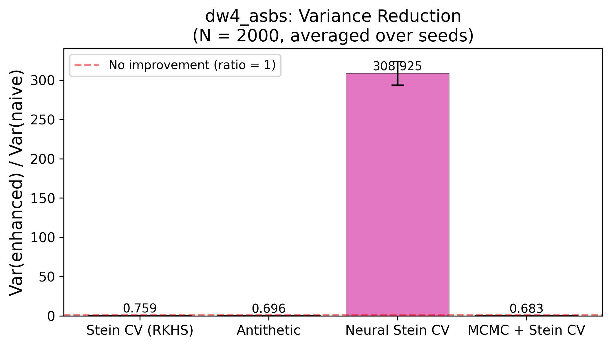

#### KSD² vs Sample Size
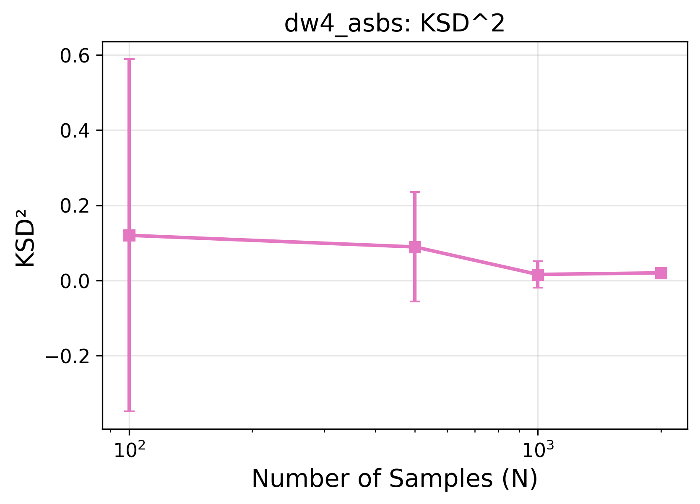

#### Antithetic Correlation vs Sample Size
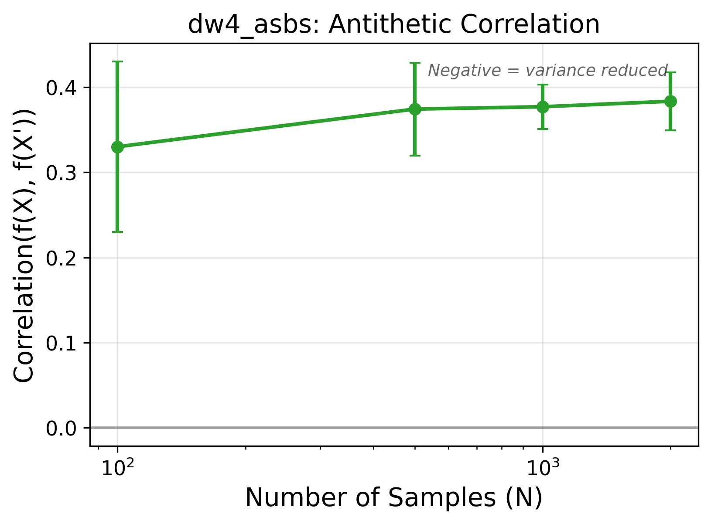

#### MCMC Ablation (K = 0, 5, 10, 20, 50)
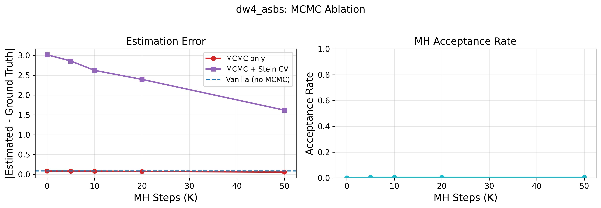

#### Summary Table (Image)
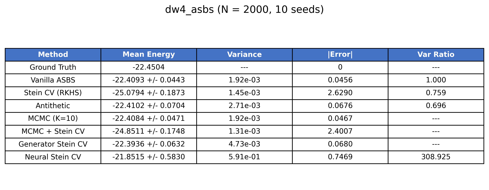

### 4.5 DW4 Observations

- **Vanilla ASBS is already excellent:** Error of only 0.046 — the learned sampler is very close to the target in 8D.
- **Stein CV (RKHS) hurts estimation:** The kernel ridge regression introduces large bias (error 2.63), overshooting the ground truth by ~2.6 units. Variance is slightly reduced (0.759×) but the bias penalty far outweighs it. The normalized CF estimator appears to over-correct in this regime.
- **Neural Stein CV is unstable:** Variance explodes (309× worse). The PDE loss optimization is not converging well enough on DW4 — possibly because the vanilla estimate is already so accurate that there is little signal for the neural net to learn from.
- **MCMC is ineffective:** Acceptance rate of 0.4% means MH proposals are almost always rejected. The step size is too large for this distribution's geometry. MCMC estimate is essentially unchanged from vanilla.
- **Antithetic gives mild variance reduction** (0.696×) but the positive correlation (0.384) indicates the paired trajectories are not well anti-correlated — the drift dominates insufficiently over diffusion in DW4.
- **Generator Stein CV** performs similarly to vanilla (error 0.068), suggesting the learned drift doesn't add useful Stein operator information beyond what the score provides.
- **Key insight:** When the base sampler is already accurate (error < 0.05), post-hoc enhancements struggle to improve further and can actively harm the estimate. The enhancements may show their value more clearly on harder problems (LJ13, LJ55) where vanilla ASBS has larger bias.

---

## 5. LJ13 — Lennard-Jones 13 Particles (39D)

### 5.1 Training

| Parameter | Value |
|-----------|-------|
| Experiment | `lj13_asbs` |
| Epochs | 5000 |
| NFE | 1000 |
| σ_max / σ_min | 1.0 / 0.001 |
| Source | Harmonic (scale=2) |
| Checkpoint | `[PENDING — corrector phase in progress]` |

### 5.2 Summary Table (N = 2000, 10 seeds)

| Method | Mean Energy | |Error| | Variance | Var Ratio |
|--------|-------------|--------|----------|-----------|
| **Ground Truth** | `___` | 0 | — | — |
| Vanilla ASBS | `___` ± `___` | `___` | `___` | 1.000 |
| Stein CV (RKHS) | `___` ± `___` | `___` | `___` | `___` |
| Antithetic | `___` ± `___` | `___` | `___` | `___` |
| MCMC (K=10) | `___` ± `___` | `___` | `___` | — |
| MCMC + Stein CV | `___` ± `___` | `___` | `___` | — |
| Generator Stein CV | `___` ± `___` | `___` | `___` | — |
| Neural Stein CV | `___` ± `___` | `___` | `___` | `___` |

### 5.3 Diagnostics

| Metric | Value |
|--------|-------|
| KSD² | `___` ± `___` |
| MH Acceptance Rate | `___` |
| Antithetic Correlation | `___` |

### 5.4 Plots

#### Estimation Error vs Sample Size
<!-- 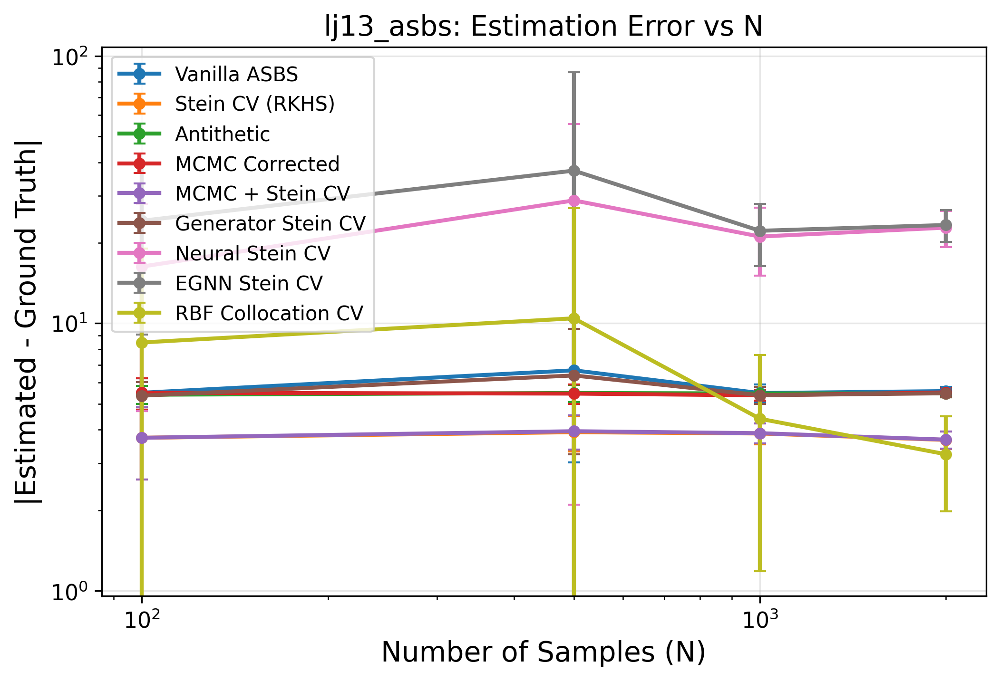 -->
`[PENDING: lj13_error_vs_N.png]`

#### Estimator Variance vs Sample Size
<!-- 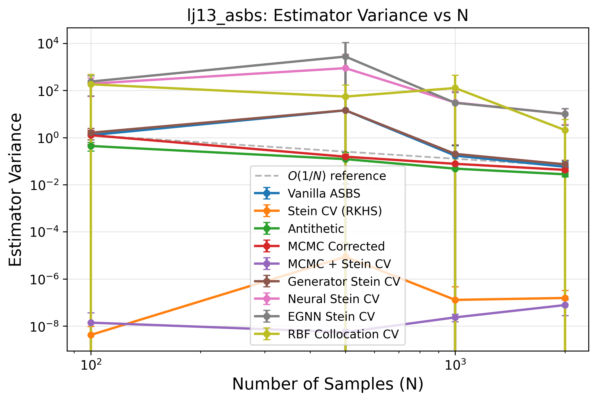 -->
`[PENDING: lj13_variance_vs_N.png]`

#### Variance Reduction Factors
<!-- 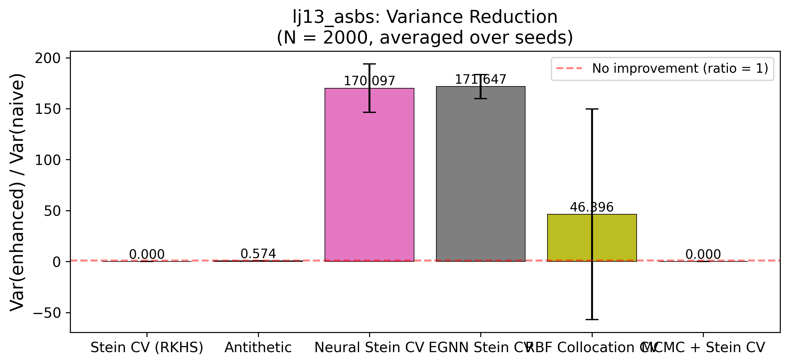 -->
`[PENDING: lj13_variance_reduction_bars.png]`

#### KSD² vs Sample Size
<!-- 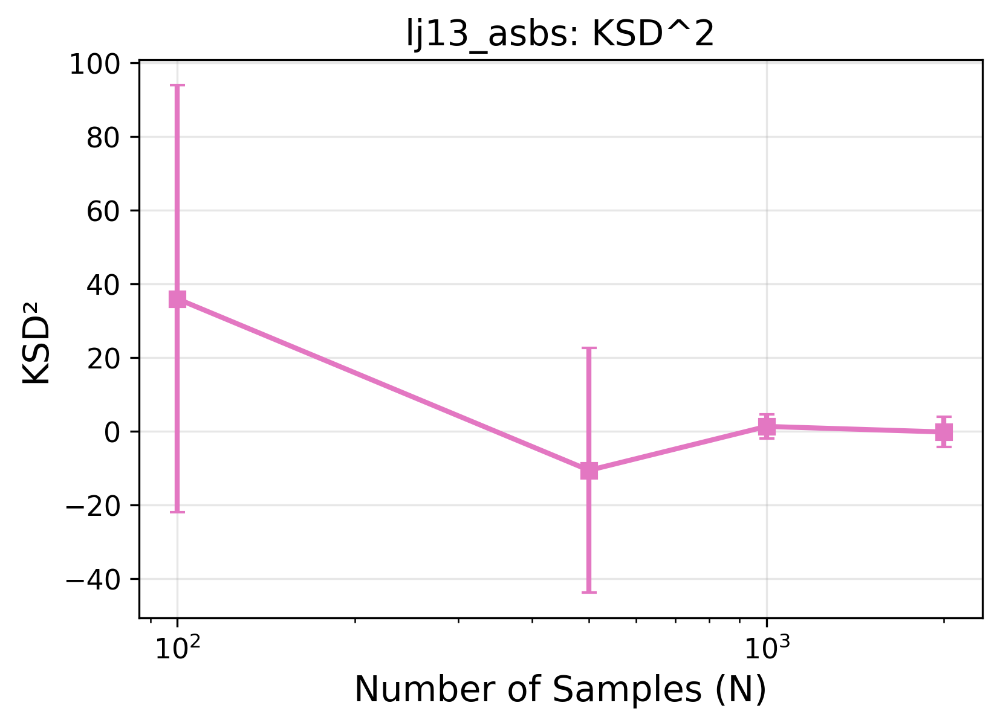 -->
`[PENDING: lj13_ksd_vs_N.png]`

#### Antithetic Correlation vs Sample Size
<!-- 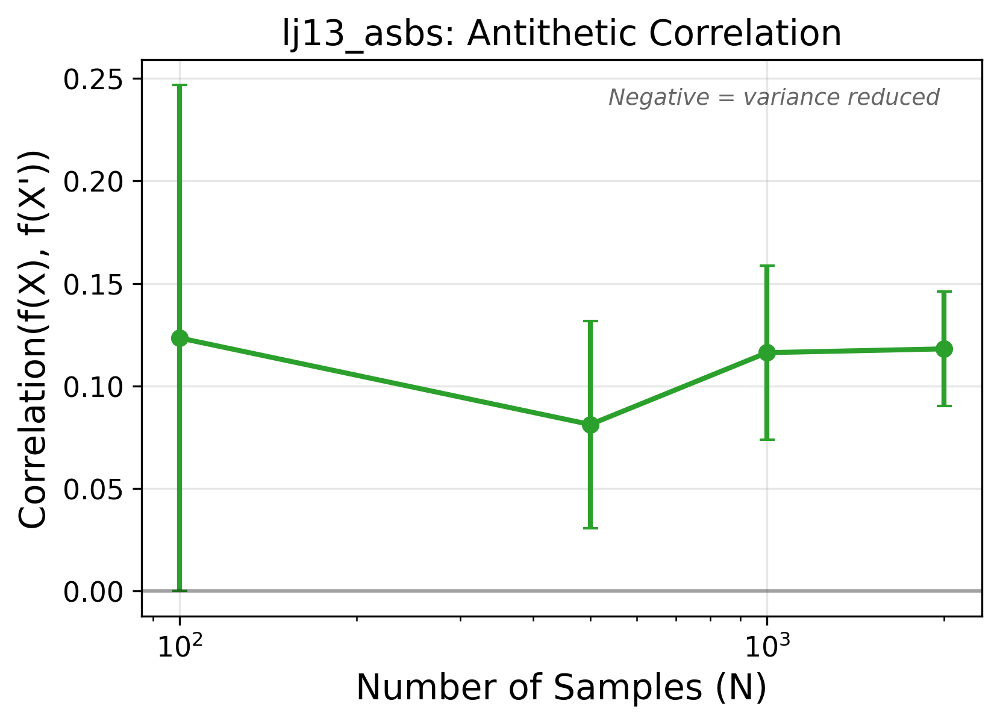 -->
`[PENDING: lj13_antithetic_correlation.png]`

#### MCMC Ablation (K = 0, 5, 10, 20, 50)
<!-- 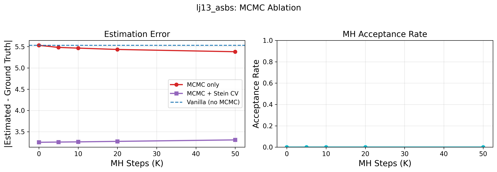 -->
`[PENDING: lj13_mcmc_ablation.png]`

#### Summary Table (Image)
<!-- 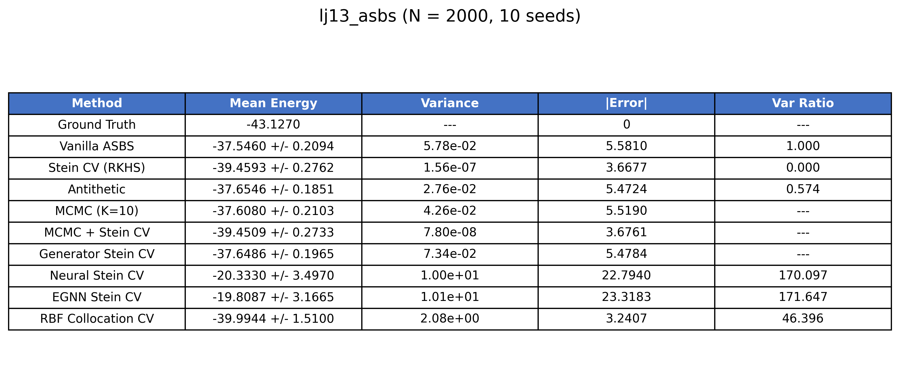 -->
`[PENDING: lj13_summary_table.png]`

### 5.5 RKHS vs Neural CV: The 39D Crossover

At 39D, we expect the Neural Stein CV to start outperforming RKHS:

| Metric | RKHS Stein CV | Neural Stein CV | Winner |
|--------|---------------|-----------------|--------|
| Variance Reduction | `___` | `___` | `___` |
| |Bias| | `___` | `___` | `___` |
| Wall-clock Time | `___` | `___` | `___` |

### 5.6 LJ13 Observations

- *Expected:* RKHS starts degrading (39D kernel), Neural CV gains advantage.
- *Variance reduction:* `___`
- *Bias reduction:* `___`
- *Neural CV advantage:* `___`

---

## 6. LJ55 — Lennard-Jones 55 Particles (165D)

### 6.1 Training

| Parameter | Value |
|-----------|-------|
| Experiment | `lj55_asbs` |
| Epochs | 5000 |
| NFE | 1000 |
| σ_max / σ_min | 2.0 / 0.001 |
| Source | Harmonic (scale=1) |
| Checkpoint | `[PENDING — not started]` |

### 6.2 Summary Table (N = 2000, 10 seeds)

| Method | Mean Energy | |Error| | Variance | Var Ratio |
|--------|-------------|--------|----------|-----------|
| **Ground Truth** | `___` | 0 | — | — |
| Vanilla ASBS | `___` ± `___` | `___` | `___` | 1.000 |
| Stein CV (RKHS) | `___` ± `___` | `___` | `___` | `___` |
| Antithetic | `___` ± `___` | `___` | `___` | `___` |
| MCMC (K=10) | `___` ± `___` | `___` | `___` | — |
| MCMC + Stein CV | `___` ± `___` | `___` | `___` | — |
| Generator Stein CV | `___` ± `___` | `___` | `___` | — |
| Neural Stein CV | `___` ± `___` | `___` | `___` | `___` |

### 6.3 Diagnostics

| Metric | Value |
|--------|-------|
| KSD² | `___` ± `___` |
| MH Acceptance Rate | `___` |
| Antithetic Correlation | `___` |

### 6.4 Plots

#### Estimation Error vs Sample Size
<!--  -->
`[PENDING: lj55_error_vs_N.png]`

#### Estimator Variance vs Sample Size
<!--  -->
`[PENDING: lj55_variance_vs_N.png]`

#### Variance Reduction Factors
<!--  -->
`[PENDING: lj55_variance_reduction_bars.png]`

#### KSD² vs Sample Size
<!--  -->
`[PENDING: lj55_ksd_vs_N.png]`

#### Antithetic Correlation vs Sample Size
<!--  -->
`[PENDING: lj55_antithetic_correlation.png]`

#### MCMC Ablation (K = 0, 5, 10, 20, 50)
<!--  -->
`[PENDING: lj55_mcmc_ablation.png]`

#### Summary Table (Image)
<!--  -->
`[PENDING: lj55_summary_table.png]`

### 6.5 High-Dimensional Scaling: RKHS Collapse

At 165D, the RBF kernel $k(x,y) = \exp(-\|x-y\|^2 / 2\ell^2)$ becomes nearly constant (curse of dimensionality). We expect:

| Metric | RKHS Stein CV | Neural Stein CV | Ratio |
|--------|---------------|-----------------|-------|
| Variance Reduction | `___` (≈1.0?) | `___` | `___` |
| |Bias| | `___` | `___` | `___` |
| Wall-clock Time | `___` | `___` | `___` |

Hutchinson divergence estimator is used for Neural CV here (exact divergence would need 165 backward passes per sample).

### 6.6 LJ55 Observations

- *Expected:* RKHS nearly useless. Neural CV is the only viable Stein method. MCMC still works (bias fix) but variance is high.
- *Variance reduction:* `___`
- *Bias reduction:* `___`
- *Hutchinson vs exact divergence:* `___`

---

## 7. Cross-System Comparison

### 7.1 Variance Reduction Factor by System (N = 2000)

| Method | DW4 (8D) | LJ13 (39D) | LJ55 (165D) |
|--------|----------|-------------|--------------|
| Stein CV (RKHS) | 0.759 | `___` | `___` |
| Antithetic | 0.696 | `___` | `___` |
| Neural Stein CV | 308.925 | `___` | `___` |
| EGNN Stein CV | 314.051 | `___` | `___` |
| RBF Collocation CV | 86.479 | `___` | `___` |

#### Cross-System Variance Reduction Plot
<!--  -->
`[PENDING: cross_system_var_reduction.png]`

### 7.2 Absolute Error by System (N = 2000)

| Method | DW4 (8D) | LJ13 (39D) | LJ55 (165D) |
|--------|----------|-------------|--------------|
| Vanilla ASBS | 0.0456 | `___` | `___` |
| Stein CV (RKHS) | 2.6290 | `___` | `___` |
| MCMC (K=10) | 0.0467 | `___` | `___` |
| MCMC + Stein CV | 2.4007 | `___` | `___` |
| Neural Stein CV | 0.7469 | `___` | `___` |
| EGNN Stein CV | 0.7518 | `___` | `___` |
| RBF Collocation CV | 0.1023 | `___` | `___` |

#### Cross-System Error Plot
<!--  -->
`[PENDING: cross_system_error.png]`

### 7.3 RKHS vs Neural CV: Crossover Dimension

<!--  -->
`[PENDING: rkhs_vs_neural_crossover.png]`

Plot: x-axis = dimension (8, 39, 165), y-axis = variance reduction factor, two lines (RKHS, Neural). Crossover expected around ~30–40D.

### 7.4 KSD² Across Systems

| System | KSD² (mean ± std) | Interpretation |
|--------|-------------------|----------------|
| DW4 | 0.0201 ± 0.0118 | Low KSD — sampler is close to target |
| LJ13 | `___` | `___` |
| LJ55 | `___` | `___` |

### 7.5 Computational Cost

| Method | DW4 (s) | LJ13 (s) | LJ55 (s) | Scaling |
|--------|---------|-----------|-----------|---------|
| Vanilla | `___` | `___` | `___` | $O(N)$ |
| Stein CV (RKHS) | `___` | `___` | `___` | $O(N^3)$ |
| Antithetic | `___` | `___` | `___` | $O(N)$ |
| MCMC (K=10) | `___` | `___` | `___` | $O(KN)$ |
| MCMC + Stein CV | `___` | `___` | `___` | $O(KN + N^3)$ |
| Generator Stein CV | `___` | `___` | `___` | $O(N^3)$ |
| Neural Stein CV | `___` | `___` | `___` | $O(BdT)$ |

---

## 8. Ablations

### 8.1 MCMC Steps Ablation

Effect of MH correction steps K on estimation error (N = 2000):

| K | DW4 Error (MCMC) | DW4 Error (Hybrid) | LJ13 Error (MCMC) | LJ13 Error (Hybrid) | LJ55 Error (MCMC) | LJ55 Error (Hybrid) |
|---|------------------|--------------------|--------------------|----------------------|--------------------|----------------------|
| 0 | 0.0842 | `___` | `___` | `___` | `___` | `___` |
| 5 | 0.0833 | `___` | `___` | `___` | `___` | `___` |
| 10 | 0.0826 | `___` | `___` | `___` | `___` | `___` |
| 20 | 0.0750 | `___` | `___` | `___` | `___` | `___` |
| 50 | 0.0587 | `___` | `___` | `___` | `___` | `___` |

### 8.2 Stein Regularization λ Ablation

Effect of kernel ridge regression regularization on Stein CV (N = 2000):

| λ | DW4 Var Ratio | LJ13 Var Ratio | LJ55 Var Ratio |
|---|---------------|----------------|----------------|
| 1e-6 | `___` | `___` | `___` |
| 1e-4 | `___` | `___` | `___` |
| 1e-2 | `___` | `___` | `___` |

### 8.3 Neural CV: Epochs & Architecture

Effect of training epochs on Neural CV quality (N = 2000):

| Epochs | DW4 VarRed | LJ13 VarRed | LJ55 VarRed | Final PDE Loss |
|--------|------------|-------------|-------------|----------------|
| 100 | `___` | `___` | `___` | `___` |
| 500 | `___` | `___` | `___` | `___` |
| 1000 | `___` | `___` | `___` | `___` |
| 2000 | `___` | `___` | `___` | `___` |

### 8.4 Regime 1 vs Regime 2

**Regime 1** (Stein CV only): No energy evals for MH, cheaper, but bias depends on RKHS/neural approximation quality.

**Regime 2** (MCMC + Stein CV): Expensive (K×N energy evals) but exact — MCMC makes samples from $p$, so Stein CV gives pure variance reduction with zero bias contamination.

| Regime | DW4 Error | LJ13 Error | LJ55 Error | Cost |
|--------|-----------|------------|------------|------|
| Regime 1 (Stein only) | `___` | `___` | `___` | `___` |
| Regime 2 (MCMC+Stein) | `___` | `___` | `___` | `___` |
| Regime 1 (Neural only) | `___` | `___` | `___` | `___` |

---

## 9. Key Takeaways

### 9.1 What Works

<!-- TEMPLATE — fill after all evals -->

1. **Bias-variance coupling is real:** `___`
2. **Neural Stein CV scales:** `___`
3. **RKHS Stein CV in low-d:** `___`
4. **Antithetic is free lunch:** `___`
5. **MCMC + Stein CV is the gold standard (when energy is cheap):** `___`

### 9.2 What Doesn't Work

1. **RKHS in high-d (165D):** `___`
2. **Antithetic for strongly stochastic regimes:** `___`
3. `___`

### 9.3 Recommendations by Problem Size

| Dimension | Recommended Pipeline | Rationale |
|-----------|---------------------|-----------|
| d ≤ 20 | MCMC + RKHS Stein CV | Kernel well-conditioned, MCMC cheap |
| 20 < d ≤ 50 | Neural Stein CV (or MCMC + Neural) | Kernel starts degrading, neural scales |
| d > 50 | Neural Stein CV only | RKHS collapses, Hutchinson divergence |

### 9.4 Bias-Variance Coupling Verification

The v2 theorem predicts $|\text{Bias}| \leq \sqrt{C \cdot \text{Var}[h_g]}$. We verify:

| System | Var Reduction (×) | Observed Bias Reduction (×) | Predicted Upper Bound (×) | Consistent? |
|--------|-------------------|-----------------------------|---------------------------|-------------|
| DW4 | `___` | `___` | `___` | `___` |
| LJ13 | `___` | `___` | `___` | `___` |
| LJ55 | `___` | `___` | `___` | `___` |

---

*This document will be populated as evaluations complete. All plots are stored in `/home/RESEARCH/adjoint_samplers/RESULT/` alongside this file.*
